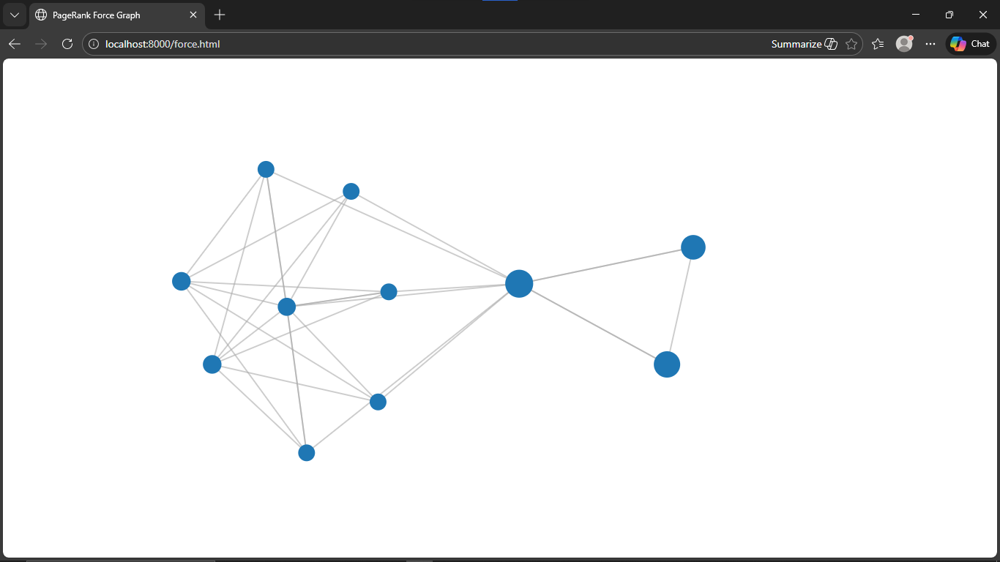

# PageRank Web Crawler & Visualization



This project is a **Python-based simulation of a search engine ranking system** inspired by Google’s original **PageRank algorithm**.

It crawls web pages, stores link relationships in a database, computes PageRank scores using an iterative algorithm, and visualizes the web structure as an interactive graph.

This is an **educational project** focused on understanding how search engines work internally.

---

## 📌 What This Project Does

- Crawls web pages starting from a seed URL  
- Extracts and stores links between pages  
- Builds a directed graph of the website  
- Computes PageRank scores iteratively  
- Visualizes the web graph using D3.js  

---

## 🛠️ Technologies Used

- Python  
- SQLite  
- BeautifulSoup  
- urllib  
- D3.js  
- HTML / JavaScript  

---

## 📂 Project Structure

```
pagerank-web-crawler/
├── spider.py        # Web crawler
├── sprank.py        # PageRank algorithm
├── spdump.py        # Link inspection tool
├── spjson.py        # Graph data generator
├── force.html       # Visualization (D3.js)
├── spider.js        # Generated graph data
├── .gitignore
└── README.md
```

---

## ✅ Prerequisites

- Python 3.7 or later
- Install dependency:

```bash
pip install beautifulsoup4


⸻

▶️ How to Run

1️⃣ Crawl the website

python spider.py

	•	Enter a starting URL when prompted
	•	Crawling is limited to one domain for ethical reasons

⸻

2️⃣ Compute PageRank

python sprank.py

	•	Enter number of iterations (e.g. 10)

⸻

3️⃣ Generate visualization data

python spjson.py

	•	Enter number of nodes (e.g. 20)

⸻

4️⃣ View the visualization

python -m http.server

Open in browser:

http://localhost:8000/force.html


⸻

📊 Visualization Details
	•	Node size represents PageRank importance
	•	Edges represent page links
	•	Nodes can be dragged interactively

⸻

📘 What I Learned
	•	How web crawlers work internally
	•	How PageRank distributes importance across links
	•	How iterative algorithms converge
	•	Practical use of graph theory
	•	Connecting backend data with frontend visualization

⸻

⚠️ Notes
	•	Crawling is domain-restricted by design
	•	Visualization performance depends on node count
	•	This is not a production search engine

⸻

🙏 Acknowledgment

Inspired by the Python for Everybody course
by Dr. Charles R. Severance (Coursera)

⸻

👤 Author

Gurlal Singh
Computer Science Student
Python | Data Structures | Algorithms

⭐ If you find this project useful, feel free to star the repository.
